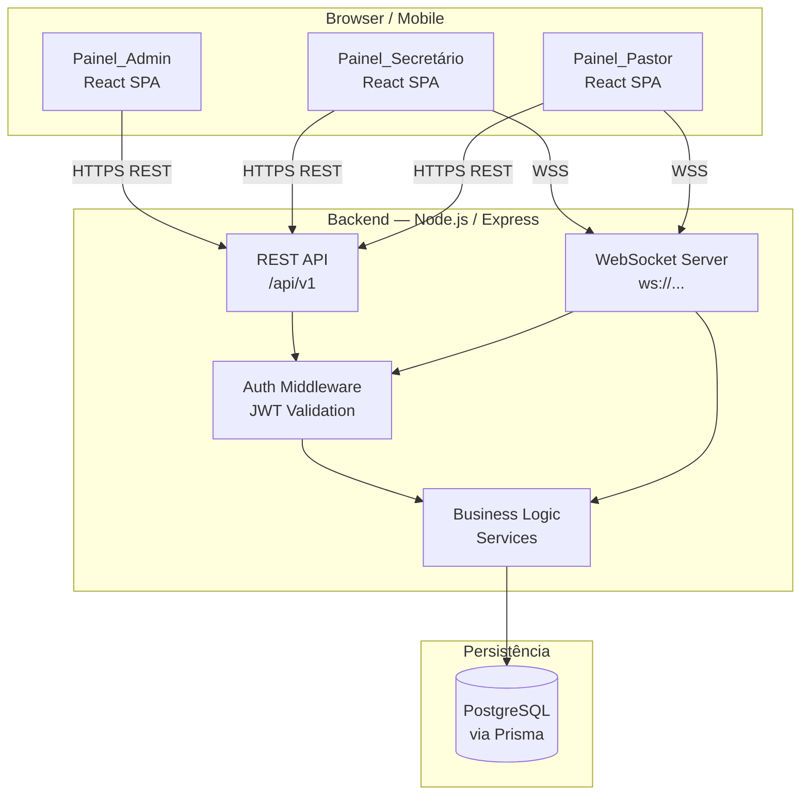
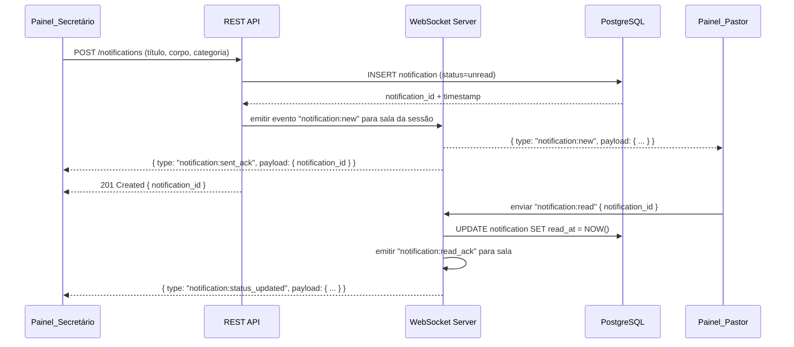

# Documento de Design — Notification Sharing

## Overview

O sistema de compartilhamento de notificações para cultos religiosos é uma aplicação web em tempo real que conecta secretários e pastores durante o culto. O Secretário envia avisos e comunicados via **Painel_Secretário**; o Pastor os recebe instantaneamente no **Painel_Pastor** com alerta sonoro/vibração. O Administrador gerencia contas pelo **Painel_Admin** e possui acesso completo às funcionalidades de Secretário e Pastor — pode enviar notificações, gerenciar categorias/templates e receber notificações em tempo real.

**Objetivos de design:**
- Entrega de notificações em **≤ 2 segundos** via canal bidirecional persistente (WebSocket).
- Interface responsiva acessível em smartphones e tablets (mobile-first).
- Histórico persistido por no mínimo 12 meses.
- Autenticação segura com bloqueio por tentativas e timeout de sessão.

**Decisões tecnológicas:**

| Camada | Tecnologia | Justificativa |
|---|---|---|
| Backend | Node.js + TypeScript (Express) | Ecossistema maduro, excelente suporte a WebSocket, tipagem end-to-end |
| WebSocket | `ws` library + lógica customizada de sala | Leve, sem overhead de protocolo proprietário; controle total de reconexão |
| Banco de dados | PostgreSQL | Suporte a queries temporais, JSON, transações; histórico de 12 meses com índices eficientes |
| ORM | Prisma | Migração automatizada, geração de tipos TypeScript, queries type-safe |
| Frontend | React + TypeScript (Vite) | SPA com roteamento por perfil; componentes reutilizáveis nos três painéis |
| Autenticação | JWT (access token de curta duração) + Refresh Token httpOnly cookie | Stateless com suporte a revogação de sessão |
| PBT | fast-check (TypeScript) | Biblioteca PBT madura para TypeScript/JavaScript |

---

## Architecture

### Diagrama de Componentes



### Diagrama de Fluxo de Notificação em Tempo Real



### Estratégia de Implantação

- Aplicação única (monolítico modular): backend Express servindo os bundles React via `express.static`.
- Variáveis de ambiente gerenciam `DATABASE_URL`, `JWT_SECRET`, `JWT_REFRESH_SECRET`, `PORT`.
- Compatível com qualquer plataforma PaaS (Railway, Render, Fly.io) ou VPS com PostgreSQL externo.

---

## Components and Interfaces

### Backend — Módulos

#### `AuthModule`
- Gerencia login, geração de tokens JWT, refresh token, bloqueio de conta e invalidação de sessão.
- Expõe: `POST /auth/login`, `POST /auth/refresh`, `POST /auth/logout`.

#### `UserModule`
- CRUD de usuários (Secretário e Pastor) exclusivamente pelo Administrador.
- O Administrador também é autorizado em todos os endpoints de CategoryModule, TemplateModule, NotificationModule e WebSocketModule.
- Expõe: `GET/POST /users`, `GET/PUT/PATCH /users/:id`.

#### `CategoryModule`
- CRUD de categorias pelo Secretário.
- Expõe: `GET/POST /categories`, `GET/PUT/DELETE /categories/:id`.

#### `TemplateModule`
- CRUD de templates. Templates padrão são protegidos contra exclusão.
- Expõe: `GET/POST /templates`, `GET/PUT/DELETE /templates/:id`.

#### `NotificationModule`
- Criação, consulta, paginação e filtro do histórico.
- Expõe: `POST /notifications`, `GET /notifications` (com filtros), `GET /notifications/:id`.

#### `WebSocketModule`
- Gerencia conexões WebSocket, autenticação via token na query string, salas de sessão, reconexão e eventos.

### Frontend — Painéis

#### `Painel_Admin`
- Rota: `/admin`
- Componentes: `UserList`, `UserForm` (criar/editar), `StatusBadge`, `ConfirmModal`.
- Sem conexão WebSocket.

#### `Painel_Secretário`
- Rota: `/secretary`
- Componentes: `NotificationForm`, `TemplateSelector`, `CategoryManager`, `TemplateManager`, `NotificationHistory` (com filtros e paginação), `ReadStatusBadge`.
- WebSocket: recebe `notification:status_updated` para atualizar status de leitura em tempo real.

#### `Painel_Pastor`
- Rota: `/pastor`
- Componentes: `NotificationFeed`, `UnreadBadge`, `NotificationCard` (com ação de marcar como lida), `ConnectionStatusBar`.
- WebSocket: recebe `notification:new`; emite `notification:read`.
- Usa `AudioContext` / `navigator.vibrate` para alertas.

---

## Data Models

### Esquema Prisma

```prisma
enum UserRole {
  ADMIN
  SECRETARY
  PASTOR
}

model User {
  id            String    @id @default(uuid())
  username      String    @unique // armazenado em lowercase para case-insensitive
  passwordHash  String
  role          UserRole
  isActive      Boolean   @default(true)
  createdAt     DateTime  @default(now())
  updatedAt     DateTime  @updatedAt

  notifications     Notification[] @relation("SentBy")
  refreshTokens     RefreshToken[]
  loginAttempts     LoginAttempt[]
}

model LoginAttempt {
  id          String   @id @default(uuid())
  username    String   // lowercase
  success     Boolean
  attemptedAt DateTime @default(now())
  ipAddress   String?

  user        User?    @relation(fields: [username], references: [username])
}

model RefreshToken {
  id        String   @id @default(uuid())
  userId    String
  token     String   @unique
  expiresAt DateTime
  revokedAt DateTime?
  createdAt DateTime @default(now())

  user      User     @relation(fields: [userId], references: [id])
}

model Category {
  id            String   @id @default(uuid())
  name          String   @unique // armazenado em lowercase para case-insensitive
  displayName   String   // nome original com capitalização do usuário
  createdAt     DateTime @default(now())
  updatedAt     DateTime @updatedAt

  notifications Notification[]
}

model Template {
  id          String   @id @default(uuid())
  title       String
  body        String
  isDefault   Boolean  @default(false) // templates padrão não podem ser excluídos
  createdAt   DateTime @default(now())
  updatedAt   DateTime @updatedAt
}

model Notification {
  id          String    @id @default(uuid())
  title       String    // até 100 caracteres
  body        String    // até 500 caracteres
  sentAt      DateTime  @default(now())
  readAt      DateTime?
  senderId    String

  categoryId  String
  category    Category  @relation(fields: [categoryId], references: [id])
  sender      User      @relation("SentBy", fields: [senderId], references: [id])

  @@index([sentAt])
  @@index([categoryId])
  @@index([readAt])
}
```

### Retenção de Dados

- Notificações são retidas por no mínimo 12 meses a partir de `sentAt`.
- Job de limpeza (cron diário) remove notificações com `sentAt < NOW() - INTERVAL '12 months'`.
- `LoginAttempt` retida por 30 dias para auditoria.

---

## Real-Time Communication Design

### Protocolo WebSocket

**Conexão:** `wss://<host>/ws?token=<access_token>`

O servidor valida o JWT na query string durante o handshake HTTP (upgrade). Conexões sem token válido são recusadas com código 401.

**Salas:** Cada conexão autenticada é associada a uma sala global única (todos os secretários e pastores da mesma instância compartilham a sala `"main"`). Isso simplifica o broadcast e suporta múltiplos dispositivos por perfil.

### Eventos Cliente → Servidor

| Evento | Payload | Quem envia |
|---|---|---|
| `notification:read` | `{ notificationId: string }` | Pastor, Admin |
| `ping` | `{}` | Qualquer cliente (keepalive) |

### Eventos Servidor → Cliente

| Evento | Payload | Destinatário |
|---|---|---|
| `notification:new` | `{ id, title, body, category, sentAt }` | Pastor, Admin |
| `notification:sent_ack` | `{ notificationId }` | Secretário, Admin |
| `notification:status_updated` | `{ notificationId, readAt }` | Secretário, Admin |
| `error` | `{ code, message }` | Remetente do evento com falha |
| `pong` | `{}` | Cliente que enviou `ping` |

### Reconexão no Cliente (Painel_Pastor)

```
Conexão perdida
  → exibir indicador de perda de conexão
  → tentativa 1 após 5s
  → tentativa 2 após 5s
  → tentativa 3 após 5s
  → tentativa 4 após 5s
  → tentativa 5 após 5s
  → se ainda falhar: exibir mensagem "Conexão perdida. Tente novamente manualmente."
```

Cada tentativa usa o access token atual; se expirado, tenta refresh antes de reconectar. O Administrador mantém conexões nos dois canais (Secretário e Pastor) simultaneamente.

---

## REST API Design

### Autenticação

| Método | Endpoint | Perfis | Descrição |
|---|---|---|---|
| POST | `/api/v1/auth/login` | Todos | Autenticar e receber tokens |
| POST | `/api/v1/auth/refresh` | Todos | Renovar access token via refresh token |
| POST | `/api/v1/auth/logout` | Todos | Revogar refresh token |

#### POST `/api/v1/auth/login`
```json
// Request
{ "username": "string", "password": "string" }

// Response 200
{ "accessToken": "string", "user": { "id": "uuid", "username": "string", "role": "ADMIN|SECRETARY|PASTOR" } }
// + Set-Cookie: refreshToken=...; HttpOnly; Secure; SameSite=Strict

// Response 401
{ "error": "INVALID_CREDENTIALS", "message": "Credenciais inválidas." }

// Response 423
{ "error": "ACCOUNT_LOCKED", "message": "Conta bloqueada por 15 minutos." }
```

### Usuários (Admin apenas)

| Método | Endpoint | Descrição |
|---|---|---|
| GET | `/api/v1/users` | Listar todos os usuários (alfabético) |
| POST | `/api/v1/users` | Criar novo usuário |
| PUT | `/api/v1/users/:id` | Editar usuário |
| PATCH | `/api/v1/users/:id/status` | Ativar/desativar conta |

### Categorias (Secretário, Admin)

| Método | Endpoint | Descrição |
|---|---|---|
| GET | `/api/v1/categories` | Listar categorias (alfabético) |
| POST | `/api/v1/categories` | Criar categoria |
| PUT | `/api/v1/categories/:id` | Editar nome |
| DELETE | `/api/v1/categories/:id` | Excluir categoria |

### Templates (Secretário, Admin)

| Método | Endpoint | Descrição |
|---|---|---|
| GET | `/api/v1/templates` | Listar templates |
| POST | `/api/v1/templates` | Criar template |
| PUT | `/api/v1/templates/:id` | Editar template |
| DELETE | `/api/v1/templates/:id` | Excluir template (não-padrão) |

### Notificações (Secretário / Pastor)

| Método | Endpoint | Perfis | Descrição |
|---|---|---|---|
| POST | `/api/v1/notifications` | Secretário, Admin | Criar e enviar notificação |
| GET | `/api/v1/notifications` | Secretário, Admin | Histórico com filtros e paginação |
| GET | `/api/v1/notifications/:id` | Secretário, Admin, Pastor | Detalhe de notificação |

**Parâmetros de filtro para GET `/api/v1/notifications`:**
- `categoryId`: UUID da categoria
- `from`: data ISO 8601 (início do intervalo)
- `to`: data ISO 8601 (fim do intervalo, máx. 31 dias a partir de `from`)
- `page`: número da página (padrão: 1)
- `pageSize`: máx. 50 (padrão: 50)

---

## Authentication and Authorization

### Fluxo de Tokens

- **Access Token (JWT):** expiração de 15 minutos; contém `{ sub: userId, role, iat, exp }`.
- **Refresh Token:** string opaca armazenada como httpOnly cookie; expiração de 8 horas (alinhada ao timeout de inatividade); armazenado no banco em `RefreshToken`.
- Ao expirar a sessão por inatividade (8h), o refresh token é revogado pelo servidor.

### Bloqueio de Conta

```
Rastrear LoginAttempt por username (case-insensitive)
Se últimas 5 tentativas (dentro de janela deslizante) forem todas falhas:
  → bloquear por 15 minutos
  → retornar HTTP 423 com mensagem de bloqueio
```

### Autorização por Perfil

| Recurso | ADMIN | SECRETARY | PASTOR |
|---|---|---|---|
| Gerenciar usuários | ✓ | ✗ | ✗ |
| Categorias / Templates | ✓ | ✓ | ✗ |
| Criar notificações | ✓ | ✓ | ✗ |
| Ler histórico de notificações | ✓ | ✓ | ✗ |
| Marcar como lida (WebSocket) | ✓ | ✗ | ✓ |
| Receber notificações (WebSocket) | ✓ | ✗ | ✓ |

Middleware de autorização rejeita requisições de perfil incorreto com HTTP 403.

---

## Error Handling

### Códigos de Erro Padronizados (REST)

| Código HTTP | Código de Erro | Situação |
|---|---|---|
| 400 | `VALIDATION_ERROR` | Campos inválidos ou ausentes |
| 401 | `INVALID_CREDENTIALS` | Login incorreto |
| 401 | `TOKEN_EXPIRED` | Access token expirado |
| 403 | `FORBIDDEN` | Perfil sem permissão |
| 404 | `NOT_FOUND` | Recurso inexistente |
| 409 | `CONFLICT` | Nome duplicado (usuário, categoria) |
| 422 | `BUSINESS_RULE_VIOLATION` | Ex: excluir template padrão; desativar própria conta |
| 423 | `ACCOUNT_LOCKED` | Conta bloqueada por tentativas excessivas |
| 500 | `INTERNAL_ERROR` | Erro inesperado |

### Erros de Entrega WebSocket

- Se a tentativa de broadcast falhar (ex: nenhum cliente conectado), a notificação já está persistida no banco — o Pastor a receberá ao reconectar via GET `/notifications`.
- O Painel_Secretário exibe alerta se o ACK não for recebido em 3 segundos após o POST.

### Desconexão do Pastor

- Ao reconectar, o Painel_Pastor carrega notificações não lidas via REST (`GET /notifications`) e exibe as pendentes.
- O contador de não lidas é calculado a partir da lista carregada, garantindo consistência mesmo após reconexão.

---

## Testing Strategy

### Abordagem Dual

O sistema utiliza dois tipos complementares de testes:

- **Testes de unidade/exemplo:** verificam comportamentos específicos, casos de borda e condições de erro.
- **Testes baseados em propriedades (PBT):** verificam propriedades universais sobre todas as entradas válidas, usando a biblioteca **fast-check**.

### Testes de Unidade

- Serviços de negócio (AuthService, NotificationService, CategoryService, etc.)
- Validações de entrada (campos obrigatórios, limites de caracteres, unicidade case-insensitive)
- Lógica de bloqueio de conta (janela deslizante de 5 tentativas)
- Lógica de timeout de sessão

### Testes de Integração

- Fluxos REST completos com banco de dados em memória (ou PostgreSQL de teste)
- Handshake WebSocket e entrega de eventos end-to-end
- Fluxo de reconexão e recarregamento de notificações pendentes

### Testes Baseados em Propriedades (fast-check)

Cada propriedade descrita na seção **Propriedades de Correção** abaixo é implementada como um único teste PBT configurado com mínimo de **100 iterações**.

Formato de anotação:
```
// Feature: notification-sharing, Property <N>: <texto da propriedade>
```

### Testes de Componentes (Frontend)

- Renderização dos três painéis com dados mockados
- Comportamento do contador de não lidas no Painel_Pastor
- Atualização de status de leitura no Painel_Secretário

---

## Correctness Properties

*Uma propriedade é uma característica ou comportamento que deve ser verdadeiro em todas as execuções válidas de um sistema — essencialmente, uma declaração formal sobre o que o sistema deve fazer. As propriedades servem como ponte entre especificações legíveis por humanos e garantias de correção verificáveis por máquinas.*


### Property 1: Autenticação — credencial válida retorna token com perfil correto

*Para qualquer* usuário ativo com username e senha válidos cadastrados no sistema, a tentativa de login deve retornar um access token cujo payload contenha o `userId` e o `role` correspondentes ao registro desse usuário.

**Validates: Requirements 1.2**

---

### Property 2: Autenticação — credencial inválida é sempre rejeitada

*Para qualquer* string de username e senha que não corresponda a nenhum usuário ativo no sistema, a tentativa de login deve retornar erro 401 e não deve retornar token algum.

**Validates: Requirements 1.3**

---

### Property 3: Criação de usuário — round-trip de cadastro

*Para qualquer* combinação de username válido (3–50 caracteres não-espaço, único no sistema) e senha válida (≥ 8 caracteres), criar um usuário com perfil Secretário ou Pastor deve resultar em:
1. O usuário aparecendo na listagem de usuários com o username e role informados.
2. O usuário sendo capaz de realizar login com as credenciais cadastradas.

**Validates: Requirements 2.1, 2.2**

---

### Property 4: Unicidade de username é case-insensitive

*Para qualquer* username existente no sistema, tentar criar um novo usuário com qualquer variação de capitalização desse username deve ser rejeitado com erro de conflito.

**Validates: Requirements 2.3**

---

### Property 5: Ciclo de vida de conta — desativação bloqueia e reativação restaura

*Para qualquer* conta de usuário Secretário ou Pastor ativa:
1. Após desativação, qualquer tentativa de login com as credenciais dessa conta deve ser rejeitada.
2. Após reativação da mesma conta, o login com as mesmas credenciais deve ser aceito novamente.

**Validates: Requirements 2.5, 2.8**

---

### Property 6: Listagem de usuários e categorias em ordem alfabética

*Para qualquer* conjunto de N usuários cadastrados no sistema, a listagem retornada pelo Painel_Admin deve apresentar todos os N usuários em ordem alfabética crescente por username (case-insensitive).

*Para qualquer* conjunto de N categorias cadastradas, a listagem retornada pelo Painel_Secretário deve apresentar todas as N categorias em ordem alfabética crescente por nome (case-insensitive).

**Validates: Requirements 2.7, 3.6**

---

### Property 7: Criação de categoria — round-trip e unicidade case-insensitive

*Para qualquer* nome de categoria válido (1–50 caracteres não-espaço) único no sistema, criar a categoria deve resultar em ela aparecer na listagem. Para qualquer variação de capitalização de um nome já existente, a criação deve ser rejeitada.

**Validates: Requirements 3.1, 3.2, 3.3, 3.7**

---

### Property 8: Exclusão de categoria preserva notificações existentes

*Para qualquer* categoria com N notificações associadas, após a exclusão da categoria:
1. A categoria não deve mais aparecer na listagem.
2. As N notificações devem continuar existindo com título, corpo e categoria original intactos.

**Validates: Requirements 3.5**

---

### Property 9: Validação de templates — campos obrigatórios não-espaço

*Para qualquer* string composta inteiramente por espaços (ou string vazia) no campo título ou corpo de um template, a tentativa de criação ou edição deve ser rejeitada. Para qualquer título com 1–100 caracteres não-espaço e corpo com 1–500 caracteres não-espaço, a criação deve ser aceita.

**Validates: Requirements 4.2, 4.3**

---

### Property 10: Seleção de template preenche formulário com conteúdo exato

*Para qualquer* template válido armazenado no sistema, selecioná-lo no formulário de notificação deve preencher os campos título e corpo com exatamente o conteúdo do template (sem truncamento, adição ou alteração de caracteres), mantendo os campos editáveis.

**Validates: Requirements 4.4, 5.8**

---

### Property 11: Edição de template não altera notificações já enviadas

*Para qualquer* template que tenha sido usado como base para N notificações já enviadas, editar o conteúdo do template não deve alterar o título nem o corpo de nenhuma das N notificações existentes.

**Validates: Requirements 4.5**

---

### Property 12: Criação de notificação — round-trip com timestamp

*Para qualquer* combinação de título válido (1–100 chars), corpo válido (1–500 chars) e categoria existente, criar uma notificação deve resultar em:
1. A notificação sendo persistida com um `sentAt` preenchido com timestamp válido (dentro de um intervalo razoável do momento da criação).
2. A notificação aparecendo na listagem do Painel_Secretário.

**Validates: Requirements 5.1, 5.2**

---

### Property 13: Listagem de notificações respeita ordem cronológica decrescente

*Para qualquer* conjunto de N notificações criadas em momentos distintos, a listagem retornada pelo Painel_Secretário e pelo Painel_Pastor deve apresentar as notificações em ordem estritamente decrescente por `sentAt`.

**Validates: Requirements 5.7, 6.5**

---

### Property 14: Contador de notificações não lidas reflete estado atual

*Para qualquer* sequência de N notificações recebidas e M marcações como lida (M ≤ N), o contador de não lidas exibido no cabeçalho do Painel_Pastor deve ser exatamente N - M.

**Validates: Requirements 6.2**

---

### Property 15: Marcação como lida — idempotência e registro de timestamp

*Para qualquer* notificação não lida marcada como lida:
1. `readAt` deve ser preenchido com um timestamp válido.
2. Marcar a mesma notificação como lida uma segunda vez não deve alterar o valor de `readAt` nem retornar erro.

**Validates: Requirements 7.2, 7.7**

---

### Property 16: Renderização de notificação inclui todos os campos obrigatórios com destaque correto

*Para qualquer* notificação renderizada no Painel_Pastor:
- Se `readAt` for nulo, a notificação deve ter indicador visual de "não lida" (classe CSS ou ícone distinto).
- Se `readAt` estiver preenchido, a notificação não deve ter o indicador de "não lida".

*Para qualquer* notificação renderizada no histórico do Painel_Secretário, o resultado renderizado deve conter: título, nome da categoria, `sentAt` formatado e status de leitura (incluindo `readAt` formatado quando lida).

**Validates: Requirements 7.5, 7.6, 8.4**

---

### Property 17: Filtros do histórico retornam apenas resultados compatíveis

*Para qualquer* combinação de filtros válidos (categoryId e/ou intervalo de datas ≤ 31 dias), todos os resultados retornados devem satisfazer integralmente os filtros aplicados — nenhum resultado fora da categoria ou fora do intervalo de datas deve aparecer na resposta.

**Validates: Requirements 8.2**

---

### Property 18: Paginação do histórico respeita o limite máximo de 50 itens por página

*Para qualquer* query de histórico que retorne mais de 50 notificações no total, cada página individual retornada deve conter no máximo 50 notificações, e a navegação entre páginas deve cobrir todas as N notificações sem duplicação ou omissão.

**Validates: Requirements 8.6**
